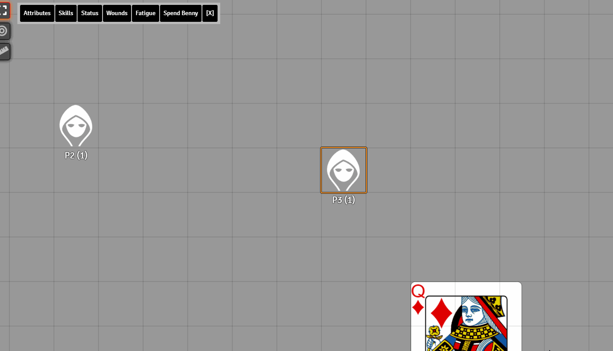

# Token Bar (SWADE)

This is a token bar inspired by the 5E Tokenbar module written by Kekilla0 (https://github.com/Kekilla0/TokenBar)

Creates a bar when a token is clicked on that lets you do 1 Click rolls for Attributes & Skills, spend Bennies, toggle Statuses, Increase/Decrease Wounds & Fatigue

